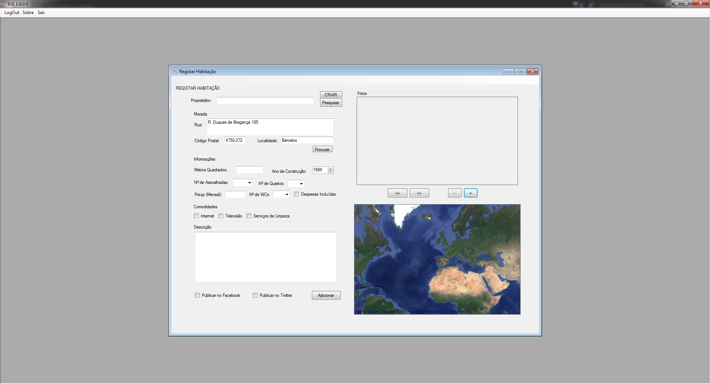

# IGE - ImovCelos

Projecto de Engenharia de Software - IPCA 2016

Tabela de Conteúdos
=================

  * [Documentação](./Documentação)
  * [Estrutura]()
    * [Backend](./Backend)
    * [Middleware](./Middleware)
    * [Frontend](./Frontend)
  * [Serviços Externos]()
    * [Google Maps](./GoogleMaps)
    * [Google Places](./GooglePlaces)
    * [Facebook](./Frontend/Facebook.cs)
    * [Twitter](./Frontend/Twitter.cs)
  * [Testes](./MiddlewareTests)

Página do Facebook: https://www.facebook.com/ImovCelos/
Página do Twitter: https://twitter.com/ImovCelos

## License

All rights reserved.
